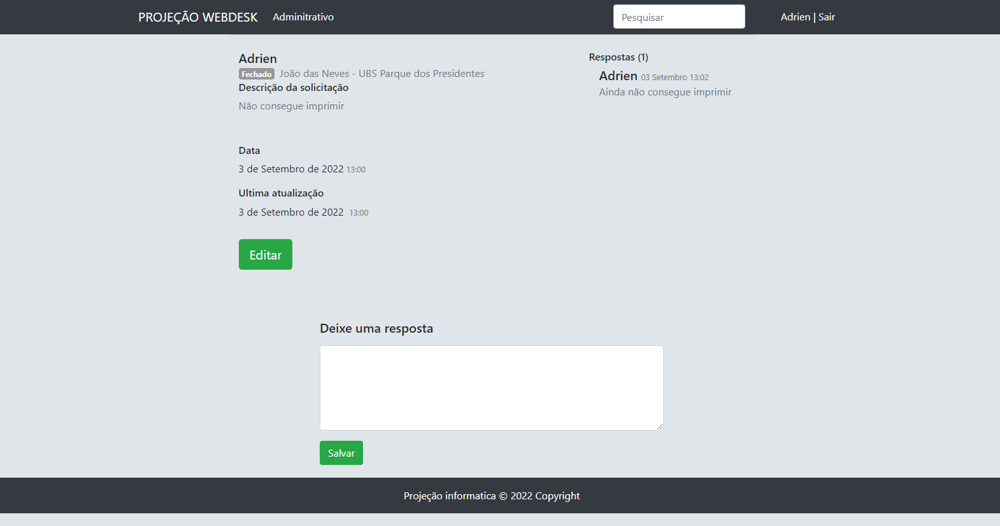
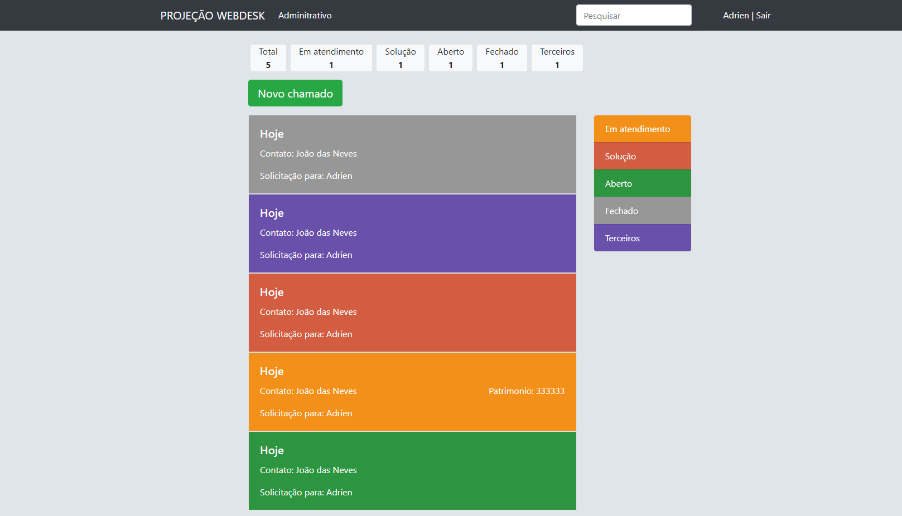

# Titulo do Projeto
[(Back to top)](#project-title)

<h2>Django - Helpdesk</h2>

 Um sistema de helpdesk em Django

- [Titulo do Projeto](#project-title)
- [Caracteristicas](#table-of-contents)
- [Começando](#começando)
- [Tecnologias](#tecnologias))
- [Screenshots](#screenshots))
- [License](#license)
- [Footer](#footer)

# Caracteristicas

- [x] Chamados com cores conforme o status
- [x] Possibilidade adicionar novos status
- [x] Cadastro de Setores, Locais, Solicitantes, Solicitações, Status
- [x] Login para acesso ao site
- [ ] Reponsivo
- [ ] Modo noturno
- [ ] Abrir para adicionar e editar chamado na mesma guia da lista de chamados
- [ ] Formulário para adicionar solicitante rapidamente
- [ ] Login para acesso ao site

  # Começando
  [(Back to top)](#começando)

  Ter uma instalação do <a href="https://www.python.org/downloads/release/python-399/"> Python 3.9</a>

- Clone esse repositório.
- No terminal:
  - Ir ao diretório do projeto: cd <diretorio>
  - python3.9 -m venv myvenv
  - Ativar a maquina virtual: myvenv\Scripts\activate
  - Atualizar o pip: pip install --upgrade pip
  - Instalar os requisitos: pip install -r requirements.txt

Esse projeto é feito com Postgres. Caso queira usar outro Gerenciador de Banco de Dados, não esqueça de alterar em settings.py:

DATABASES = {
'default': {
'ENGINE': 'django.db.backends.postgresql_psycopg2',

    - Crie um banco de dados chamado: webdesk2 ou escolha outro nome e mude em DATABASES em settings.py
    - Faça as migrações. No terminal: python manage.py makemigrations
    - python manage.py migrate
    - Crie um super usuario: python manage.py createsuperuser
    - Para rodar o projeto: python manage.py runserver
    - Para acessar o site: No navegador http://127.0.0.1:8000/
    - Para acessar o admin: //127.0.0.1:8000/admin

# Tecnologias
[(Back to top)](#tecnologias)

-[Python] (<a href="https://www.python.org/" rel="nofollow">https://www.python.org/</a>)  -[Django] (<a href="https://www.djangoproject.com/" rel="nofollow">https://www.djangoproject.com/</a>)  -[Postgres] (<a href="https://www.postgresql.org/" rel="nofollow">https://www.postgresql.org/</a>)

# Screenshots
[(Back to top)](#screenshots)

 

  

 
 

  

 

# License
[(Back to top)](#license)

<a href="LICENSE.md">MIT</a>
 
# Footer
[(Back to top)](#footer)

